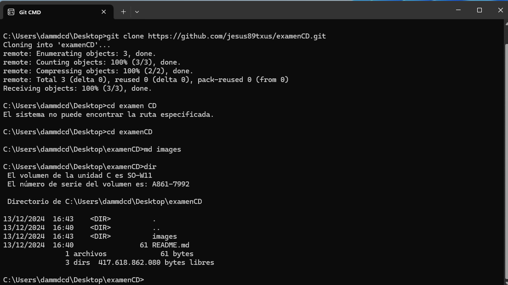
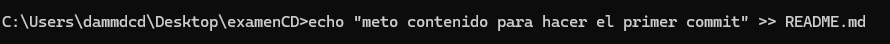

# examenCD
repositorio para examen contornos de desarrollo
"meto contenido para hacer el primer commit y probar que el push sale bien" 

# PRIMER COMMIT REPOSITORIO CLONADO A LOCAL  

  

# SEGUNDO COMMIT AÑADO MAS IMAGENES PARA COMPLETAR EL TRABAJO  

# AÑADO CONTENIDO AL README.MD

  

 # AÑADO CAPTURA CON CON EL GIT STATUS